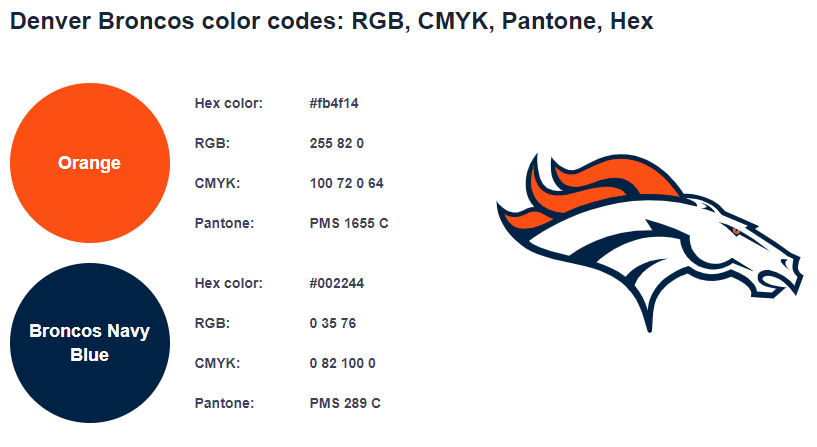

# **Broncos Country**

## **Introduction**

Welcome to my first milestone project as part of my full stack developer course with Code Institue.

Broncos Country is a website for fans of the NFL team the Denver Broncos. On this site you can find 
information about the teams history, players and  2021 season opponents. Primary goal of this site 
is for the user to sign up to my weekly Broncos Country Newsletter.

---

## Table Of Contents ##
* [UX](#ux)
    * [Strategy](#Strategy)
        * [Site Owners Goals](#Site-Owners-Goals)
        * [External Users Goals](#External-Users-Goals)
        * [User Stories](User-Stories)
     * [Scope](#Scope)
     * [Stucture and Skeleton](#Stucture-andSkeleton)
        * [Wireframes](#Wireframes)
    * [Surface](#Surface)
        * [Fonts](#Typography)
        * [Icons](#Icons)
        * [Colors](#Colors)
* [Features](#Features)
    * [Existing Features](#Existing-Features)
    * [Future Features](#Future-Features)
* [Technologies Used](#Technologies-Used)
* [Testing](#Testing)
* [Deployment](#Deployment)
* [Credits](#Credits)

## **UX**

### **Strategy**

* #### **Site Owners Goals**
    * To promote the Denver Broncos
    * To provide information about the Denver Broncos
    * To provide a good user experience 
    * To get users to sign up to the weekly email 

* #### **External Users Goals**
    * A website that is visually eye catching 
    * Be able to view website across all devices
    * Website filled with interesting content
    * Form to sign up to the weekly emails
    * To be able to use the links to view the social media sites 
    * To be able to view pictures of team players, superbowl wins and the 2021 season opponents

* #### **User Stories**
    * As a user, I want to know who the site is about
    * As a user, I want to find information and facts about the team 
    * As a user, I want to find out how many and what Superbowls they've won
    * As a user, I want to see who the upcoming seasons opponents are
    * As a user, I want to read about the players 
    * As a user, I want the website to be easy to navigate 
    * As a user, I want the website to work on all devices
    * As a user, I want the website to be informative as this will increase the chances of signing up for
    the weekly newsletter 
    * As a user, I need the website to be easy and simple to use 
    * As a user, I expect social meadia links to open on a seperate tab

### **Scope**

* #### **Expectations**
    * When clicking a link (ie social media ), I expect the page to open in a new tab
    * I expect feedback from the newsletter after I've signed up
    * I expect the nav bar links to navagate me around the site correctly 
    * I expect a good designed website that allows for an enjoyable user experience 

* #### **Requirements**
    * Responsive design that works on all devices 
    * Navigation menu that is simple to use 
    * Well designed and functional
    * Visually appealing
    * Sign up form for newsletter that is easy to use 

    
### **Stucture and Skeleton**
This website will have a sigle page structure, due to its easier flow. The website will have a navigation bar and a minimum of 4 sections linked to it.

For the base of this structure ive used __Bootstrap__, it will provide numerous elements on the page from the responsive design to the buttons and nav bar.

* #### **Wireframes**
    For my Wireframes ive used __Balsamiq__.I've created 3 Wireframe to show desktop, tablet and mobile 

    links bellow 

    * #### [**__Desktop Wireframe__**](wireframes/Broncos-Country-Desktop.png)
    * #### [**__Tablet Wireframe__**](wireframes/Broncos-Country-tablet.png)
    * #### [**__Mobile Wireframe__**](wireframes/Broncos-Country-Mobile.png)

    
### **Surface**
As the Denver Broncos are a sports team, I've made my design choices based on their color scheme, and images of players and the stadium.

* #### **Fonts**
    I've used __Google Fonts__ to find an apporiate font for this project. For my heading I've used Ubuntu , 

    For my content I've used Oxygen. I've used these fonts to stand out  and compliment one another.

* #### **Icons**
    The icons I've utilized in the project are from __Font Awesome__. The main icon used is to turn the nav bar into an american football on mobile devices.

* #### **Colors**
    Ive based my color scheme on the teams main colors.
    I've researched and found on [Code of colors](https://www.codeofcolors.com/denver-broncos-colors.html) the RGBA color codes so I can implement them in my project.

    

## **Features**

### **Existing Features**

*   #### **Hero Image**

     I have used a full width hero image at the top of the page, this will be an aerial view of the team stadium. This will also have the name of the website over the image.

*   #### **Navigation**

     I've used __Bootstraps Javascript__ to implement a responsive navbar, on mobile device it will have an american football icon. It will have the navbar fixed to the top of the page and include 5 links to allow easy navigation.

*    #### **Welcome Section**

     This displays the teams old logo 1 short paragraphs, these will have 3 fact sections about the teams history. One facts section  will be hidden on mobile for design purposes.

*    #### **Superbowl Wins**
     I've used __Bootstraps__ grid to add 3 pictures of the Superbowls the team have won, these will have the score and a short write up underneath. For mobile devices the images will be displayed on the left with the paragraphs on the right.

*    #### **Players To Watch**
     Again with the help of  __Bootstrap__ I've used two player head shots one left and one right with a write up underneath, on mobile devices these will be displayed side by side, the same as the Superbowl wins.

*    #### **Season Opponents**
     I've used __Bootstraps__ grid to display both home and away opponents seperated by a verticle line, images will be used for each team. On mobile devices the verticle line will be lost and the home will be above the away teams separated by a horizontal rule.

*    #### **Sign Up Form**
     Here I've included the link to the relevent social media sites and the sign up for the weekly newsletter.
     After the user fills out the form and hits the sign up button, feedback will be given in the form of a pop up modal.

* ### **Future Features**

    * News section for the latest stories about the Denver Broncos and around the NFL.
    * Live score board with information on the games as they are being played. 
    * Full 53 man roster stats sheet.
    * A database to store all the emails that sign up to the weekly newsletter.
    * A comment section so fans can interact with each other.

## **Technologies Used**

* ### **Languages**
     * [HTML](https://en.wikipedia.org/wiki/HTML)
     * [CSS](https://en.wikipedia.org/wiki/Cascading_Style_Sheets)
     * [JavaScript](https://en.wikipedia.org/wiki/JavaScript)

* ### **Tools and Libraries**
     * [GitHub](https://github.com/)
     * [Bootstrap](https://getbootstrap.com/)
     * [Google Fonts](https://fonts.google.com/)
    * [Balsamic](https://balsamiq.com/wireframes/)
     * [Font Awesome](https://fontawesome.com/)
     * [W3C HTML Validation Service](https://validator.w3.org/)
     * [W3C CSS Validation Service](https://jigsaw.w3.org/css-validator/)
     * [techsini](http://techsini.com/)

## **Testing**

  ### Nav Bar ###

* I wanted a colapsable nav bar with an american football icon and 5 working links to navigate the page. 
       I also wanted a logo that will be used as another link button. To do this I used bootstrap and font awesome. 
        
* To test I viewed the webpage page on different browsers, viewed it on different devices clicking on all the links to navigate through the page.

* I found that the nav bar worked as I wanted it to. The only issue I found was that it wouldnt collapse when I clicked a link. I found a piece of javascript on slack that solved the problem.

 ### SuperBowl Wins ###

* I wanted the 3 images of the SuperBowl wins with the teams, scores and a short write up underneath the images.To do this I used bootstraps grid system.

* To test I viewed the webpage page on different browsers and viewed it on different devices. 

* I found that the image sizing that I used didnt look as well on mobile as it did on desktop, this was resolved by changing the sizing.

 ### Season Opponents ###

* I want all 17 season opponents displayed home and away in 2 grids with a dividing vetical line and a dividing horiziontal in mobile with home above and away below.

* To test I viewed the webpage page on different browser and viewed it on different devices. 

* I found that my image sizing didnt translate to mobile divices as well as I wanted and they had to be changed.

## **Deployment**

This project was deployed via GitHub by executing the following steps.
After writing the code, committing and pushing it to GitHub:

1. Log in to **GitHub** and locate the **Repository**
1. Go to your github repository and click on "Settings" tab
1. Then go to "Pages" tab in the left hand side sidebar.
* 1.Then under "Source" click the "None" dropdown and select the "Main" branch
Click "Save"
1. The page will update and at the top it will say: "Your site is ready to be published at https://10-andy.github.io/Broncos-Country/

## **Credits**

I've used the following websites for my project 

* [Pro Football Hall Of Fame](https://www.profootballhof.com/)
* [wikipedia](https://www.wikipedia.org/)
* [ESPN](https://www.espn.com/)
* [w3schools](https://www.w3schools.com/)
* [CSS Tricks](https://css-tricks.com/)
